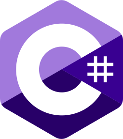
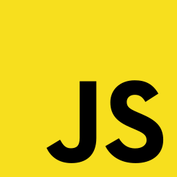

# RayfieldDev

###### About me
- Hey, i'm Rayfield a 15 year old self-though programming enthusiast from Norway. I've actually been writing code in many languages for over 5+ years.

###### Language Experience
‎

###### Github Stats

###### Support
- [You can buy me a coffe by clicking](https://www.buymeacoffee.com/teashirt)
